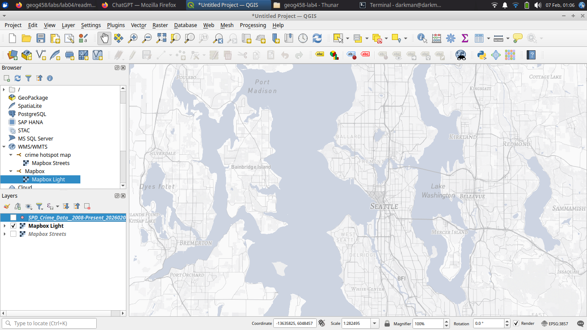
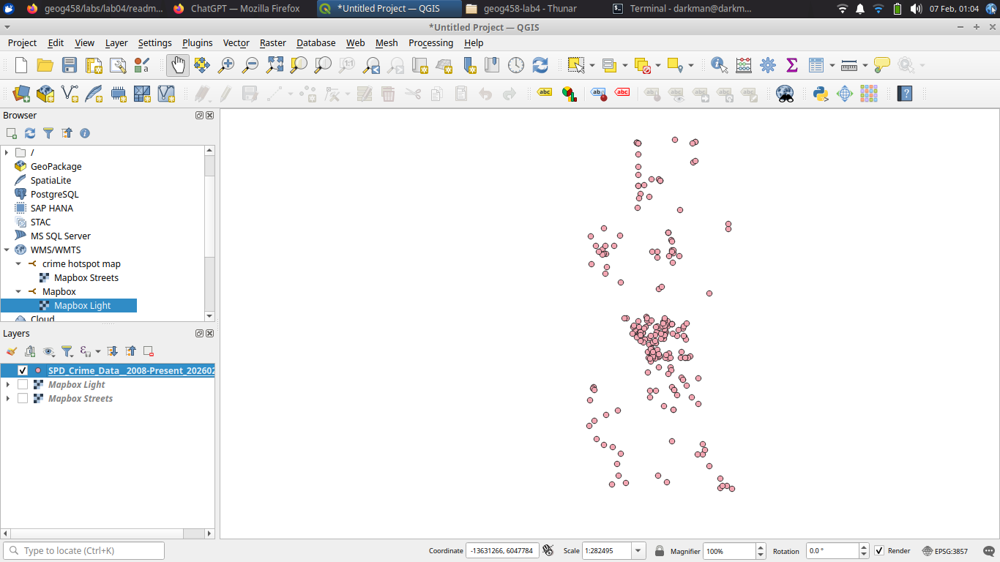
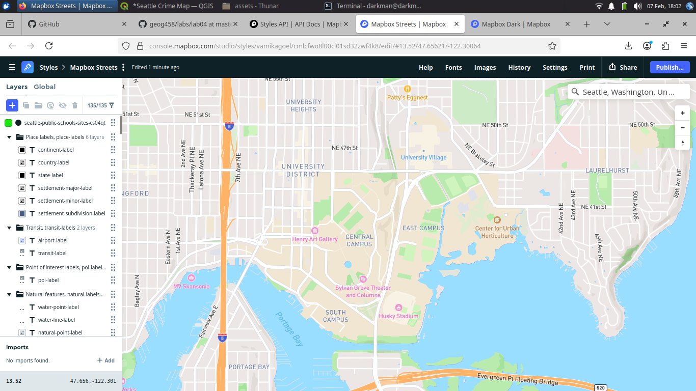

# Seattle Crime Map (University of Washington Area)

## 🌐 Web Map URL
https://ngumoe.github.io/Seattle-Crime-Map/

---

## 🗺 Examined Geographic Area
This project focuses on the **University of Washington (UW) campus and surrounding neighborhoods in Seattle, Washington**. The area was selected to analyze spatial patterns of violent crime incidents within a dense urban and academic environment.

---

## 🔍 Tile Set Descriptions

### 1️⃣ Basemap (tileset_1)
A customized dark-themed Mapbox basemap designed to provide geographic context.  
**Modifications include:**
- Bridge icons replaced with bridge symbols
- Settlement label fonts changed to Barlow (Bold, Medium, Italic)
- Water color styled to medium grey

**Zoom Levels:** 11–15

📸  

---

### 2️⃣ Crime Data Layer (tileset_2)
A thematic layer showing **violent crime incidents** sourced from Seattle Police Department data.

**Filters Applied:**
- Date Range: Feb 7, 2025 – Feb 7, 2026  
- Categories: Violent crimes  
- Subcategories: Larceny Theft, Arson, Aggravated Assault, Fraud, Sex Offenses, Homicide

**Zoom Levels:** 11–15

📸  

---

### 3️⃣ Basemap + Crime Layer (tileset_3)
A composite tileset combining the customized basemap with the filtered violent crime dataset to provide both context and thematic information.

**Zoom Levels:** 11–15

📸  

---

### 4️⃣ Crime Hotspots Theme (tileset_4)
A themed Mapbox-designed layer highlighting crime hotspots using color emphasis and symbolic styling to enhance visual interpretation.

**Zoom Levels:** 11–15

📸  

---

## 🛠 Technologies Used
- QGIS (QMetaTiles)
- Mapbox Studio
- Mapbox GL JS
- GitHub Pages

---

## 📌 Project Purpose
This project demonstrates how custom basemaps and thematic crime data can be integrated into a web mapping application using raster tiles and Mapbox GL JS.
